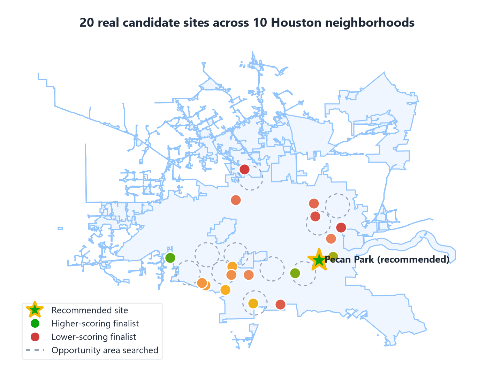

# Slide 1 of 12 - Title / Recommendation

How to use this file: copy the TITLE block into the slide's title placeholder,
copy the BODY block into the slide's body placeholder, then manually insert
the image into the slide (Google Slides does not import images from pasted
markdown - drag the PNG in from `docs/slides/images/`).

## PASTE INTO SLIDE - TITLE

Houston Family Dollar Site Recommendation

## PASTE INTO SLIDE - BODY

Recommendation: acquire 6600 Stillwell St, Pecan Park, Houston, TX

- Selected from 20 real candidate parcels across 10 Houston neighborhoods
- Citywide screen of all 1,115 Harris County census tracts, not one submarket
- Verified traffic, strong trade-area demand, low flood risk, benchmark-gated score

## IMAGE

Insert full-bleed on the right half of the slide, title and bullets on the left.

## SPEAKER NOTES

Lead with the recommendation immediately. This is a citywide result, not a
single-neighborhood pick - the map shows all 20 real candidates that were
compared before this one was chosen.
