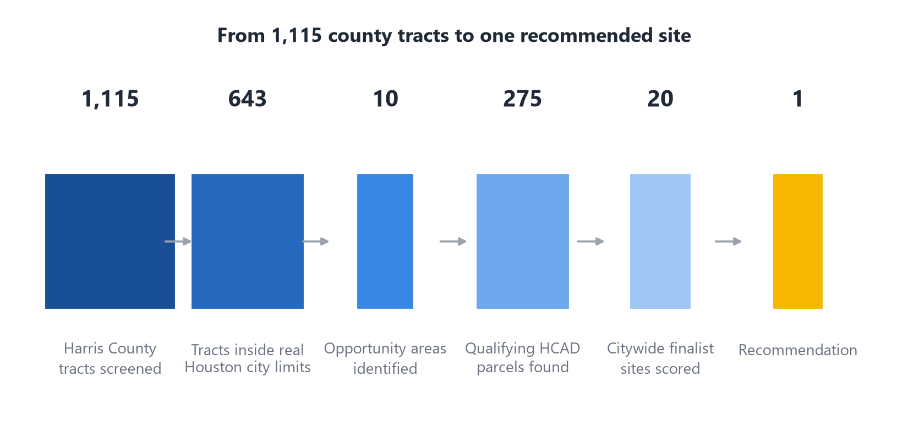

# Slide 3 of 12 - Scope and Method Pipeline

## PASTE INTO SLIDE - TITLE

How the Recommendation Was Built

## PASTE INTO SLIDE - BODY

- Question: where in the City of Houston should Family Dollar open its next store?
- Constraint: only free, public, reproducible data - no paid vendor data, nothing hand-typed
- Screened all 1,115 Harris County census tracts, kept the 643 actually inside Houston city limits
- Found 10 opportunity areas at least 2.75 miles apart, then 275 real HCAD parcels, then 20 finalist sites
- Every finalist enriched with real traffic, flood zone, drive-time demand, competition, crime, and
  affordable/assisted-housing data - 18 free public sources total, four rounds of adding real signals

## IMAGE

Insert full-width beneath the bullets, or full-bleed on the right half of the slide.

## SPEAKER NOTES

Walk from macro to micro: county, then city, then neighborhood, then parcel.
Stress that all 20 finalists are real, addressed (or real intersection-anchored)
parcels with actual HCAD account numbers, not hypothetical points on a map.
