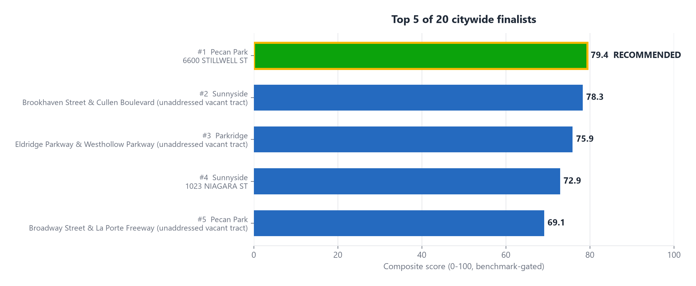

# Slide 5 of 12 - Top Finalists

## PASTE INTO SLIDE - TITLE

Top 5 of 20 Citywide Finalists

## PASTE INTO SLIDE - BODY

- #1 Sunnyside, Brookhaven St & Cullen Blvd - score 68.8 - RECOMMENDED
- #2 Sunnyside, 1023 Niagara St - score 67.9 - close alternate, but fails the traffic benchmark (1,547 vpd)
- #3 Parkridge, Eldridge Pkwy & Westhollow Pkwy - score 65.8 - highest verified traffic and by far the best crime reading of any finalist
- #4 Pecan Park, 6600 Stillwell St - score 64.6
- #5 Pecan Park, Broadway St & La Porte Fwy - score 64.5 - fails the traffic benchmark

## IMAGE

Insert full-bleed - this chart carries the whole slide, keep bullets short above or beside it.

## SPEAKER NOTES

Keep the ranking simple - do not read every row. Focus on the separation between

# 1 and #2 (only 0.9 points) and flag that #2 and #5 look competitive on score alone

but fail the 8,000 AADT minimum-traffic benchmark, which is why they are not
selectable as the primary recommendation regardless of score.
