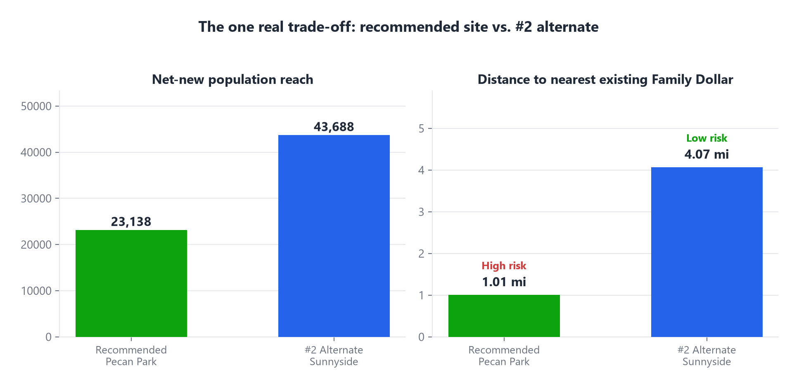

# Slide 7 of 12 - Key Trade-Off

## PASTE INTO SLIDE - TITLE

Cannibalization vs. Net-New Reach

## PASTE INTO SLIDE - BODY

- Recommended site: 1.01 miles from an existing Family Dollar, 47.8% trade-area overlap - High cannibalization risk
- #2 Sunnyside alternate: 4.07 miles away, 0% overlap - Low cannibalization risk, and a higher net-new population reach (43,688 vs. 23,138)
- Both are real, comparably strong candidates - 78.3 vs. 79.4, a 1.1-point gap
- This is a genuine strategic fork, not a data quality issue - reported plainly, not smoothed over
- Decision point for leadership: maximize composite score, or minimize overlap with the existing network

## IMAGE

Insert full-bleed - let the two panels carry the comparison.

## SPEAKER NOTES

Pause here. This is the core decision fork and likely where questions start.
Existing Family Dollar stores are tracked as network, not competition - the
real question is how much of the new store's trade area an existing store
already serves. Both numbers are computed the same way for both sites.
