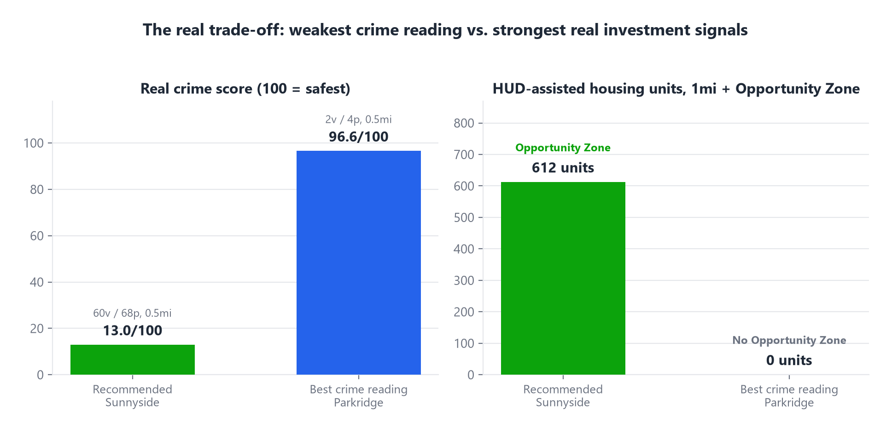

# Slide 7 of 12 - Key Trade-Off

## PASTE INTO SLIDE - TITLE

Weakest Crime Reading, Strongest Real Investment Signals

## PASTE INTO SLIDE - BODY

- Recommended site: 60 violent + 68 property Part I incidents within 0.5 mi (trailing 12 mo) - a crime
  score of 13.0/100, the weakest of any top-5 finalist, reported plainly, not smoothed over
- Eldridge Pkwy & Westhollow Pkwy (Parkridge, #3, score 65.8) has by far the best crime reading in the
  field - 2 violent + 4 property, crime score 96.6 - and the highest verified traffic, but sits in no
  Opportunity Zone and has zero HUD-assisted housing nearby
- The recommended site carries a real federal Opportunity Zone designation and 612 real HUD-assisted
  housing units within 1 mile - both scored at the maximum (100/100) - which is what outweighs the
  weaker crime reading in the composite score
- This is a genuine strategic fork, not a data quality issue: crime exposure vs. federal
  investment-zone status and subsidized-housing concentration
- Decision point for leadership: weight cannibalization risk and investment-zone signals most heavily
  (favors the recommendation), or weight crime and raw traffic most heavily (favors Parkridge instead)

## IMAGE

Insert full-bleed - let the two panels carry the comparison.

## SPEAKER NOTES

Pause here. This is the core decision fork and likely where questions start. Note what this
site does NOT trade off: it has the lowest cannibalization risk of any strong finalist (4.07 mi
from the nearest existing Family Dollar, 0% trade-area overlap) - the fork is specifically
crime vs. the two federal investment signals, not crime vs. demand or crime vs. network overlap.
