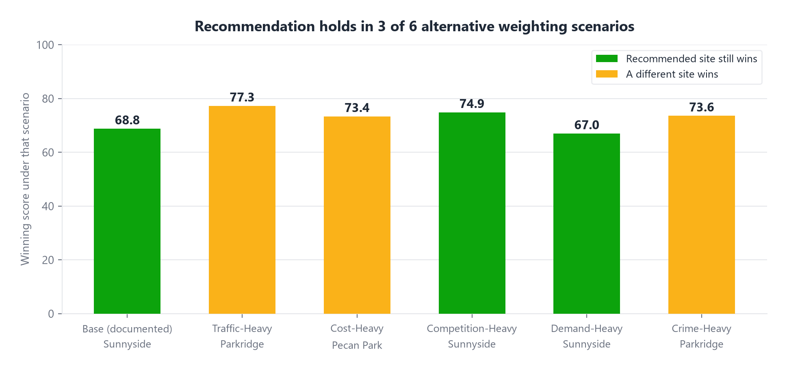

# Slide 8 of 12 - Robustness Check

## PASTE INTO SLIDE - TITLE

Sensitivity Analysis: Does the Pick Hold Up?

## PASTE INTO SLIDE - BODY

- Re-ran the same real per-factor scores under 6 different, defensible weighting schemes
- Recommended site (Sunnyside) wins outright in 3 of 6 scenarios: Base, Competition-Heavy, Demand-Heavy
- Under Traffic-Heavy and Crime-Heavy weighting, Parkridge (Eldridge Pkwy) wins instead
- Under Cost-Heavy weighting, Pecan Park (6600 Stillwell St) wins instead
- Adding two real, strongly-differentiating signals this round (Opportunity Zone, HUD Multifamily)
  made the pick less uniformly dominant, not more - a site that wins primarily on two specific
  signals will not also win a Crime-Heavy reweighting where its real weakness matters more

## IMAGE

Insert full-bleed beneath or beside the bullets.

## SPEAKER NOTES

State stability accurately: strong but not universal, and it got less universal this round
for a real, explainable reason (see slide 7). Credibility improves when limits are stated
explicitly instead of oversold. Also worth mentioning: building this exact check is what
caught the freeway-vs-frontage-road traffic bug earlier in the build - the process has
already proven it catches real errors, not just theoretical ones.
