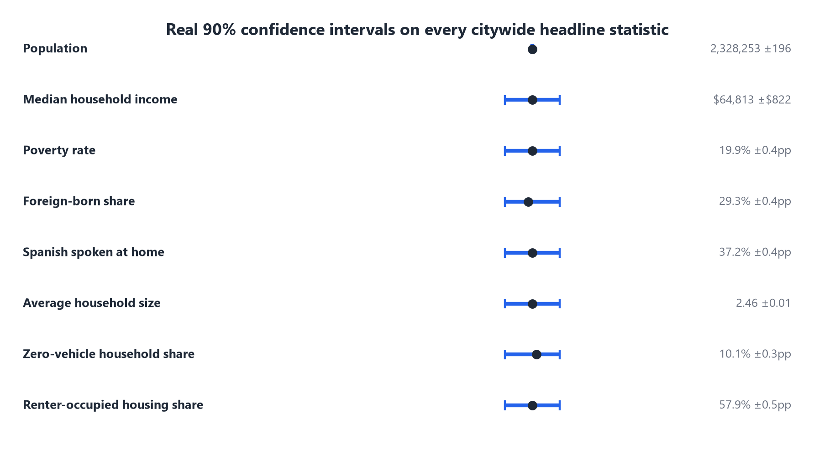

# Slide 9 of 12 - Confidence Intervals and Demographic Rigor

## PASTE INTO SLIDE - TITLE

How Uncertain Are the Underlying Numbers?

## PASTE INTO SLIDE - BODY

- Census ACS estimates are survey-based, not a full count - every one carries a real margin of error
- This analysis reports the real 90% confidence interval for every citywide headline statistic
  instead of treating point estimates as exact
- Example: citywide population is 2,328,253, 90% CI 2,328,057 to 2,328,449 - a tight, trustworthy estimate
- Median household income: $64,813, 90% CI plus or minus $822
- Foreign-born share (29.3%) and Spanish-at-home share (37.2%) matter directly here - Gulfton, Alief,
  and East Houston have large immigrant, multi-generational households, a real demand driver for
  Family Dollar's core categories that income screening alone would miss

## IMAGE

Insert full-bleed - this is a dense reference slide, let the chart do the work.

## SPEAKER NOTES

This slide exists to preempt the "how sure are you about these numbers" question
before it's asked. Keep it brief live - the chart is here mainly as backup for
Q&A and to show the rigor is real, not just claimed.
